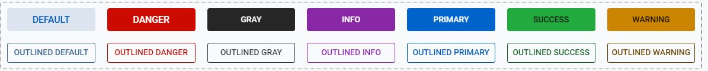

# Button

### Description

This button control object provides methods for creating and manipulating a button in applications
or webpages. The button's behavior can be modified with the methods below, and is customizable 
with various themes, styles and expanses.

### At a Glance

| Methods |
|-------------|
| <ul><li>[`Button(String text)`](#tButton)</li><li>[`Button onClick(Consumer<ButtonPushEvent> callback)`](#tClick)</li><li>[`Boolean isDisableOnClick()`](#tDisableG)</li><li>[`Button setDisableOnClick(boolean disable)`](#tDisableS)</li><li>[`Button setTheme(Button.Theme theme)`](#tThemeS)</li><li>[`Button setExpanse(Button.Expanse expanse)`](#tExpanseS)</li><li>[`TextVerticalAlignment getVerticalAlignment()`](#tVeryAlignG)</li><li>[`Button setVerticalAlignment(Button.TextVerticalAlignment alignment)`](#tVertAlignS)</li></ul>|

| Interfaces |
|------------|
| <ul><li>[`Button setText(String text)`](#)</li><li>[`Button setVisible(Boolean visible)`](#)</li><li></li></ul>            |

### Methods

| Method Name | Parameters | Returns | Description |
|:-----------:|:----------:|:-------:|-------------|
| <a name='tButton'/>`Button`| `String` | N/A | Parameterized constructor for the Button control which will set the text of the button to the string passed. May be passed no parameters as well.|
| <a name='tClick'/>`onClick` | `Consumer<ButtonPushEvent>` A function that performs the desired on-click behavior| `Button` | Function that registers a click on the button. Needs to take the function signature of a separate function which can be written to handle the click. An example function signature might be `button.onClick(this::buttonPushHandler)` where the buttonPushHandler is later defined in your program. The signature of that function may look something like this: `buttonPushHandler(ButtonPushEvent ev){...}`  |
| <a name='tDisableG'/>`isDisableOnClick` | N/A | `Boolean` | Returns whether or not the button will be disabled when clicked on. |
| <a name='tDisableS'/>`setDisableOnClick` | `Boolean` | `Button` |Sets whether or not the button will be disabled when clicked on.|
| <a name='tThemeS'/>`setTheme` | `Button.Theme` | `Button` | Sets the vertical alignment for text within a button. To do this, use one of the enums listed in the <b>[Themes section.](###Themes)</b> |
| <a name='tExpanseS'/>`setExpanse` | `Button.Expanse` | `Button` | Sets the expanse of a button based on predetermined values that can be explored in more detail in the <b>[Expanses section.](###Expanses)</b> |
| <a name='tVertAlignG'/>`getVerticalAlignment` | N/A | `Button.TextVerticalAlignment` |Returns an enum value representing the vertical alignment of the text within a button. See <b>[Vertical Alignments.](###Vertical-Text-Alignments)</b>|
| <a name='tVertAlignS'/>`setVerticalAlignment` | `Button.TextVerticalAlignment` | `Button` | Sets the vertical alignment for text within a button. To do this, use one of the enums listed in the <b>[Vertical Alignments.](###Vertical-Text-Alignments)</b>|

### Themes

The following themes are supported for use with the button control:   

 Theming is supported by use of a built-in enum class. To apply a theme, execute code similar to the following:   

    import org.dwcj.controls.button.Button;            //Contains the button control

    Button exampleButton = new Button("Example");      //Creates a new button with the text "example"
    exampleButton.setTheme(Button.Theme.DEFAULT);      //Sets the button's theme to be the default theme.

### Expanses

The following expanses are supported for use with the button control:   

 The various expanses are supported by use of a built-in enum class. To apply an expanse, execute code similar to the following:   

    import org.dwcj.controls.button.Button;            //Contains the button control

    Button exampleButton = new Button("Example");      //Creates a new button with the text "example"
    exampleButton.setTheme(Button.Expanse.MEDIUM);     //Sets the button's theme to be the default theme.

### Vertical Text Alignments

Shown below are the three options for vertical alignment of text within a button <b>(TODO REPLACE WITH VERTICAL ALIGNMENTS)</b>:   

 The various alignments are supported by use of a built-in enum class. To apply an alignment, execute code similar to the following:   

    import org.dwcj.controls.button.Button;                                   //Contains the button control

    Button exampleButton = new Button("Example");                             //Creates a new button with the text "example"
    exampleButton.setVerticalAlignment(Button.TextVerticalAlignment.CENTER);  //Sets the button's theme to be the default theme.